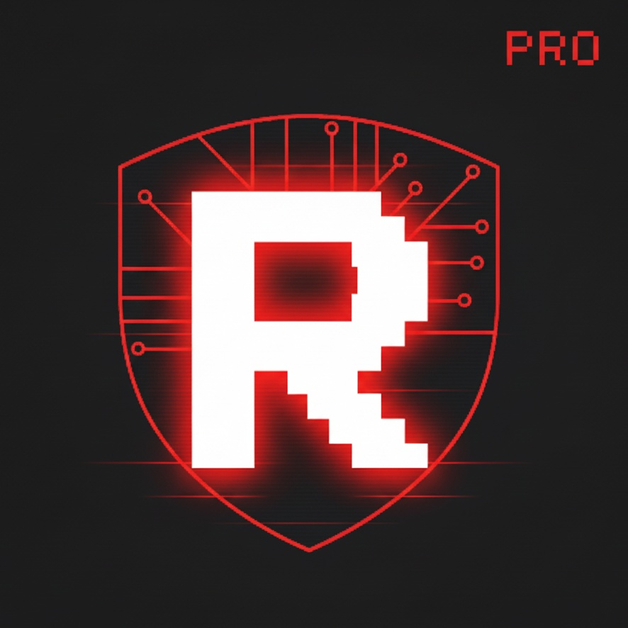
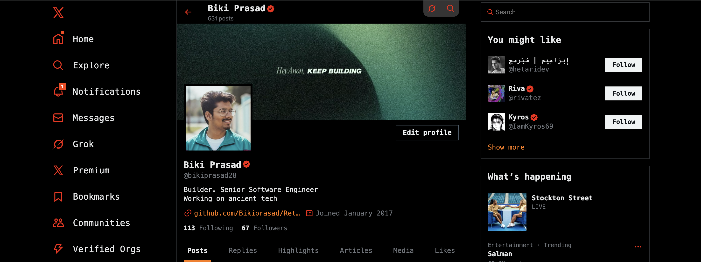
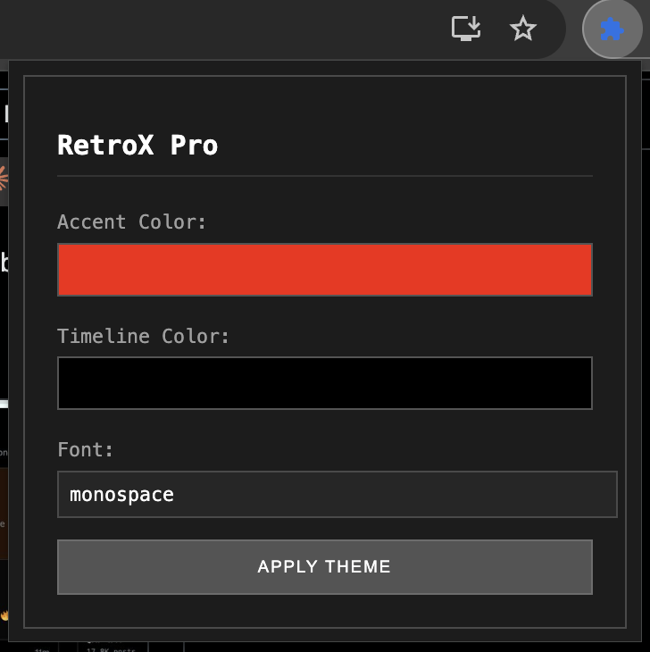
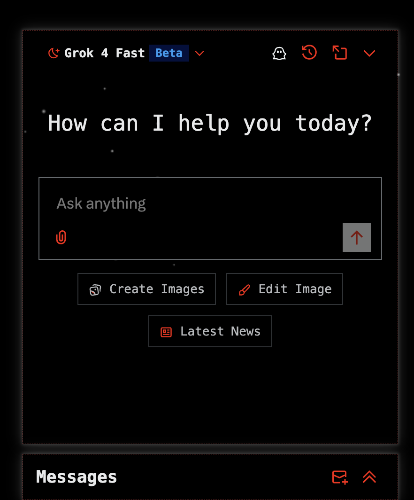

<H1> RetroX Pro </H1>
<label>Run the Ghost Protocol. This extension provides a low-signature, custom-calibrated UI overlay for maximum visual stealth and effortless theme shifting.X UI just got a futuristic facelift!
dark mode minimalism with a retro-futuristic twist, blending vintage sci-fi vibes with modern digital design</label> 

 
##Installation & Setup (Load Unpacked Extension) 

Follow these steps to quickly load and run the RetroX Pro extension in your Chrome browser. 

## Download the Source Code 
  -- Navigate to the repository on GitHub: https://github.com/Bikiprasad/RetroX-Pro 
  -- Select Download ZIP to save the project archive. 
  -- Extract the ZIP file to a local directory (e.g., ~/Projects/RetroX-Pro/).  

## Load the Extension in Chrome  
  -- Open your browser and go to the Extensions page: chrome://extensions/ 
  -- In the top-right corner, switch the Developer mode toggle to ON. 
  -- Click the Load unpacked button (top-left). 
  -- In the file explorer, select the root folder of the extracted code (the folder containing manifest.json).  

## Finalize Setup 
  -- The extension, RetroX Pro, is now loaded and active.  

Click the puzzle piece icon (Extensions button) and pin the RetroX Pro icon to your toolbar for quick access to theme controls.
